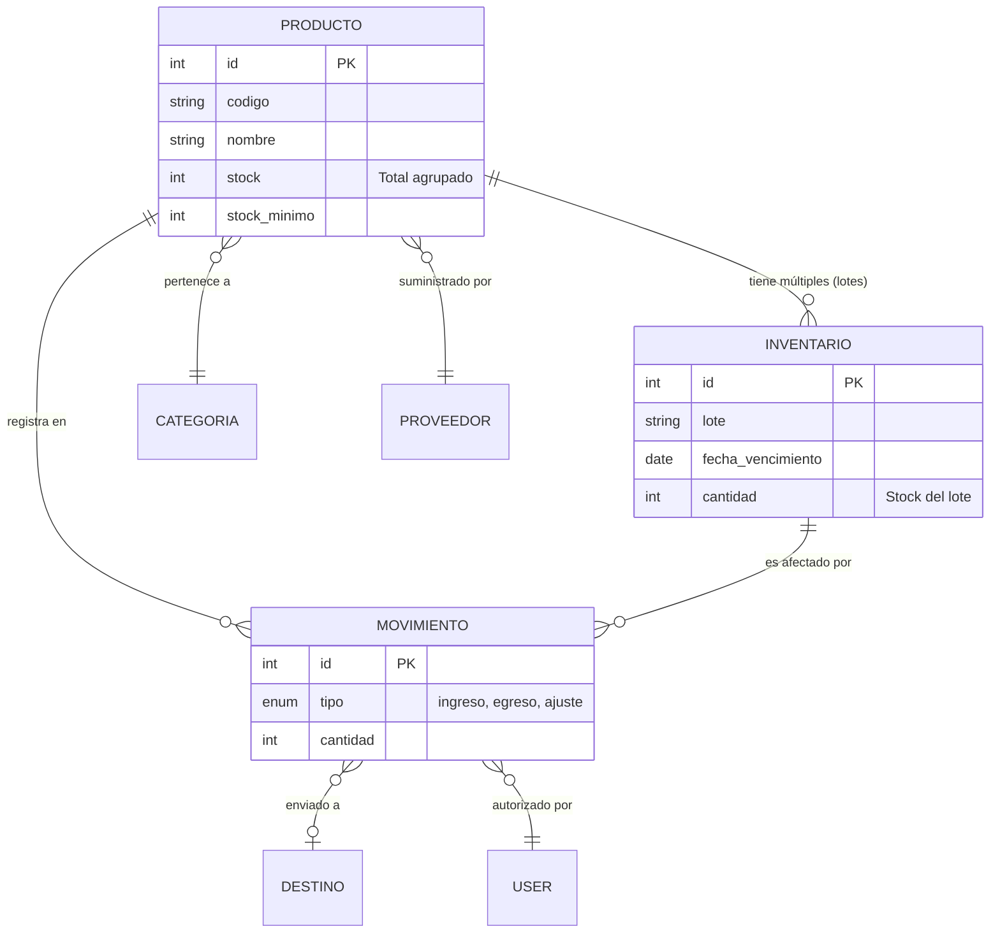

# Manual del Sistema — Inventario Médico (Técnico)

Este documento centraliza la información técnica esencial de la plataforma: arquitectura, diagrama de datos, lógica de negocio y configuraciones de despliegue. Está dirigido a desarrolladores, DevOps y administradores de sistemas.

---

## 1. Arquitectura y Stack Tecnológico

El sistema sigue un patrón MVC estricto, encapsulando la lógica de negocio compleja dentro de una capa de **Servicios** para mantener los controladores limpios y testeables.

| Componente | Tecnología / Versión | Propósito |
| :--- | :--- | :--- |
| **Framework Base** | Laravel 10/11 (PHP) | Estructura principal, Routing, ORM, Auth. |
| **Frontend** | Blade + Bootstrap 5.3 + Vanilla JS | Renderizado SSR (Server-Side Rendering) y vistas responsive. |
| **Base de Datos** | MySQL / MariaDB | Persistencia de datos relacional. |
| **Generación PDF** | DomPDF | Exportación de reportes de inventario y consumos. |
| **Seguridad** | Google reCAPTCHA v2 | Prevención de ataques automatizados en Auth. |

---

## 2. Estructura de Directorios Clave

```text
sistema-inventario-medico/
├── app/
│   ├── Http/Controllers/       # Manejan las peticiones HTTP y retornan vistas/JSON.
│   ├── Models/                 # Modelos Eloquent ORM (relaciones de base de datos).
│   └── Services/               # Lógica de Negocio (Ej. InventarioService.php).
├── config/                     # Archivos de configuración (inventario.php, services.php).
├── database/
│   ├── migrations/             # Esquemas de la base de datos (versiones).
│   └── seeders/                # Datos semilla (admin inicial, categorías por defecto).
├── resources/
│   └── views/                  # Vistas Blade (UI).
└── routes/
    └── web.php                 # Definición de rutas y asignación de Middlewares.
```

---

## 3. Modelo de Datos (Diagrama ER)

El siguiente diagrama ilustra las relaciones principales que sustentan el motor de inventario.



---

## 4. Motor de Inventario y Reglas de Negocio

Toda la lógica crítica de movimientos de stock se procesa a través de `App\Services\InventarioService`.

### 4.1. Algoritmo FEFO/FIFO
El sistema despacha mercancía priorizando el modelo **FEFO** (First Expired, First Out).
1. El algoritmo busca todos los lotes (`Inventario`) disponibles del producto.
2. Los ordena ascendentemente por `fecha_vencimiento`.
3. En caso de que no requieran vencimiento (lotes NULL), o en empates de fecha, aplica **FIFO** usando `created_at`.
4. El sistema va restando stock de los lotes iterativamente hasta satisfacer la cantidad solicitada en el egreso.

### 4.2. Bloqueos y Seguridad
> [!IMPORTANT]  
> **Lotes Vencidos:** El método de *Consumo* rechaza a nivel de backend cualquier intento de despachar un lote cuya `fecha_vencimiento` sea menor a la fecha actual.

> [!WARNING]  
> **Sincronización:** El campo `stock` en la tabla `productos` es **derivado**. En cada transacción exitosa, el sistema suma los registros de la tabla `inventarios` y sobrescribe el stock maestro. **Nunca alteres el stock de `productos` directamente por base de datos.**

---

## 5. Control de Acceso y Middleware

El sistema cuenta con un control de acceso granular mediante roles y permisos (`spatie/laravel-permission` o customizado).

1. **Rutas protegidas por `auth`:** Todo el sistema, excepto `/login` y recuperación.
2. **Middleware `is_admin`:** Restringe rutas críticas como `/usuarios` o `/bitacora`.
3. **Permisos de Módulo:** Rutas inyectadas con permisos específicos.
   - `categorias.ver`, `categorias.crear`, `categorias.eliminar`.
   - `medicamentos.ver`, `movimientos.crear`.

### 5.1. Seguridad Anti-Fuerza Bruta
- El Login y el endpoint de recuperación utilizan `throttle` de Laravel para prevenir ataques de diccionario. Tras 3 intentos fallidos de login, el middleware cambia el estado de la cuenta a "bloqueada".

---

## 6. Variables de Entorno (Configuración)

Para el despliegue del sistema, asegúrate de configurar correctamente el archivo `.env`.

```ini
APP_NAME="Inventario Médico UPTAG"
APP_ENV=production
APP_DEBUG=false
APP_URL=https://tudominio.com

DB_CONNECTION=mysql
DB_HOST=127.0.0.1
DB_PORT=3306
DB_DATABASE=nombre_bd
DB_USERNAME=usuario_bd
DB_PASSWORD=secreto

# RECAPTCHA
RECAPTCHA_ENABLED=true
RECAPTCHA_SITE_KEY=tu_clave_publica
RECAPTCHA_SECRET=tu_clave_secreta

# MAIL (Para recuperación de contraseña)
MAIL_MAILER=smtp
MAIL_HOST=smtp.mailtrap.io
MAIL_PORT=2525
MAIL_USERNAME=usuario
MAIL_PASSWORD=secreto
MAIL_ENCRYPTION=tls
MAIL_FROM_ADDRESS=no-reply@tudominio.com
```

---

## 7. Mantenimiento y Operaciones

- **Auditoría (Bitácora):** Monitorear regularmente la tabla `bitacora` (o la vista en la interfaz administrativa) para detectar posibles anomalías en eliminaciones de registros o intentos de login.
- **Limpieza de Caché:** Tras actualizar las vistas o la configuración, ejecutar:
  ```bash
  php artisan optimize:clear
  ```
- **Backup:** Se recomienda configurar un cronjob que ejecute un volcado (`mysqldump`) diario de la base de datos, ya que los datos de trazabilidad médica son de misión crítica.

> [!TIP]  
> Para consultas complejas a la base de datos o migraciones de gran volumen, utiliza siempre transacciones (`DB::beginTransaction()`) para evitar el bloqueo prolongado de la tabla `inventarios`.