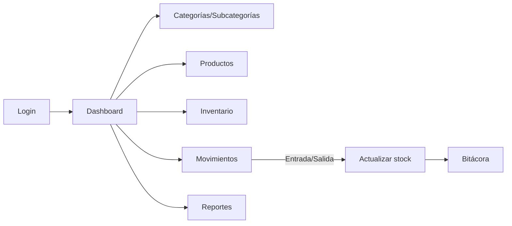

# Sistema de Inventario Médico — Casos de Uso

Fecha: 13/10/2025
Autor: Equipo SERVICIOS MEDICOS

## Objetivo
Documentar de forma clara los actores, supuestos, casos de uso y flujos principales del sistema, incluyendo módulos existentes y prototipos de módulos por implementar (Inventario, Movimientos y Reportes).

## Actores
- Administrador: gestiona usuarios, ve bitácora y tiene acceso completo a mantenimiento y reportes.
- Operador/Almacén: gestiona categorías, subcategorías, productos/medicamentos, proveedores, inventario y movimientos.
- Auditor/Visor: acceso de solo lectura a reportes y consultas.
- Sistema externo (futuro): posibles integraciones para import/export.

## Supuestos
- Autenticación por usuario/contraseña con roles básicos (admin, operador).
- Persistencia en base de datos SQLite (ambiente demo) con migraciones en el proyecto.
- No se gestionan lotes por separado aún, pero se modela fecha de vencimiento a nivel de producto; a futuro se propondrá tabla de lotes.
- El módulo de Inventario, Movimientos y Reportes está en prototipo UI con rutas y vistas base.

## Vocabulario
- Producto/Medicamento: ítem almacenable con stock, categoría, presentación y proveedor.
- Movimiento: entrada o salida de stock con motivo (compra, ajuste, consumo, devolución, baja por vencimiento, etc.).
- Inventario: consolidado de existencias, alertas y conteo cíclico.
- Bitácora: registro de acciones relevantes por usuario.

---

## Caso de uso CU-01: Autenticación de usuario
- Actor: Administrador u Operador
- Precondiciones: Usuario registrado; sistema en línea.
- Trigger: Usuario ingresa a /login.
- Flujo básico:
  1. El usuario ingresa credenciales.
  2. El sistema valida y redirige a /dashboard.
- Excepciones:
  - Credenciales inválidas → mensaje de error y permanece en login.
- Poscondiciones: Sesión iniciada; se registra en bitácora el evento de login.

## Caso de uso CU-02: Gestión de perfil y cambio de contraseña
- Actor: Usuario autenticado
- Flujo básico: Accede a Perfil, valida datos de seguridad, cambia contraseña.
- Excepciones: Datos de seguridad inválidos.

## Caso de uso CU-03: Gestión de usuarios (admin)
- Actor: Administrador
- Flujo básico: Listar, editar rol/datos, eliminar usuarios; ver bitácora.
- Reglas: Solo admin; trazabilidad en bitácora.

---

## Caso de uso CU-10: Gestión de categorías y subcategorías
- Actor: Operador/Administrador
- Flujo básico: Crear/editar/eliminar categorías y subcategorías; listar.
- Reglas: Unicidad de nombres por tabla; subcategorías asociadas a una categoría.

## Caso de uso CU-11: Gestión de productos/medicamentos
- Actor: Operador/Administrador
- Flujo básico:
  1. Crear producto con nombre, presentación, unidad, categoría, subcategoría, proveedor y fechas.
  2. El sistema genera código único candidato por nombre.
  3. Listar, filtrar, editar, eliminar.
- Reglas: Código único; stock no negativo; fechas válidas.

## Caso de uso CU-12: Gestión de proveedores (AJAX)
- Actor: Operador/Administrador
- Flujo básico: Crear/actualizar/eliminar proveedores vía modal en alta/edición de productos.

---

## Caso de uso CU-20: Visualizar inventario consolidado (Prototipo)
- Actor: Operador/Administrador
- Trigger: Acceso a /inventario
- Flujo básico:
  1. Ver tarjetas de KPIs: total ítems, existencias bajas, próximos a vencer.
  2. Filtrar por categoría, subcategoría, proveedor y texto.
  3. Ver tabla consolidada con stock actual, unidad, fechas y alertas.
- Excepciones: Sin datos → mostrar vacíos amigables.
- Poscondiciones: Ninguna; consultas de solo lectura.

## Caso de uso CU-21: Registrar movimientos de stock (Prototipo)
- Actor: Operador/Administrador
- Trigger: Acceso a /movimientos
- Flujo básico:
  1. Seleccionar tipo (Entrada/Salida) y motivo (compra, ajuste, consumo, etc.).
  2. Buscar producto y capturar cantidad; opcionalmente fecha de vencimiento.
  3. Guardar movimiento y reflejar en stock.
- Excepciones: Stock insuficiente para salidas.
- Poscondiciones: Stock actualizado; registro en bitácora.
- Nota: En prototipo solo UI y validaciones front mínimas; backend a definir.

## Caso de uso CU-22: Generar reportes (Prototipo)
- Actor: Auditor/Administrador/Operador
- Trigger: Acceso a /reportes
- Flujo básico:
  1. Seleccionar reporte: Inventario actual, Movimientos por periodo, Productos por vencer, Valorización.
  2. Aplicar filtros por fechas, categoría, proveedor.
  3. Ver tabla/indicadores y exportar (CSV/PDF en futuro).
- Excepciones: Sin resultados.

---

## Modelo de datos (actual y propuesto)
- Actual: categorias, subcategorias, productos, proveedores (AJAX), usuarios, bitacora.
- Propuesto (futuro):
  - movimientos: id, producto_id, tipo (in/out), motivo, cantidad, observaciones, fecha, created_by.
  - lotes (opcional): id, producto_id, lote, fecha_vencimiento, stock_lote.

## Reglas de negocio claves
- Código de producto único y autogenerado si no se ingresa.
- Stock no debe ser negativo; salidas requieren disponibilidad.
- Alertas por stock mínimo y proximidad a fecha de vencimiento (configurable).

## Diagramas de alto nivel
- Flujo de Autenticación → Dashboard → Mantenimientos → Inventario/Movimientos/Reportes.
- Secuencia Movimientos: UI → Validación → Persistencia → Actualización de stock → Bitácora.

## Consideraciones de seguridad
- Middleware auth obligatorio en módulos internos.
- Rol admin para usuarios y bitácora.
- Tokens CSRF activos en formularios.

## Roadmap sugerido
1) Backend Movimientos (tabla y service de stock). 2) Ajustes en Productos para stock mínimo y alertas. 3) Reportes con consultas agregadas. 4) Exportaciones CSV/PDF. 5) Lotes y vencimientos por lote. 6) Tests feature para flujos críticos.

---

## Aceptación para prototipo
- Rutas alcanzables: /inventario, /movimientos, /reportes.
- Vistas muestran KPIs/filtros/tabla dummy para explicar alcance.
- Documento presente en docs/casos_de_uso.md.

