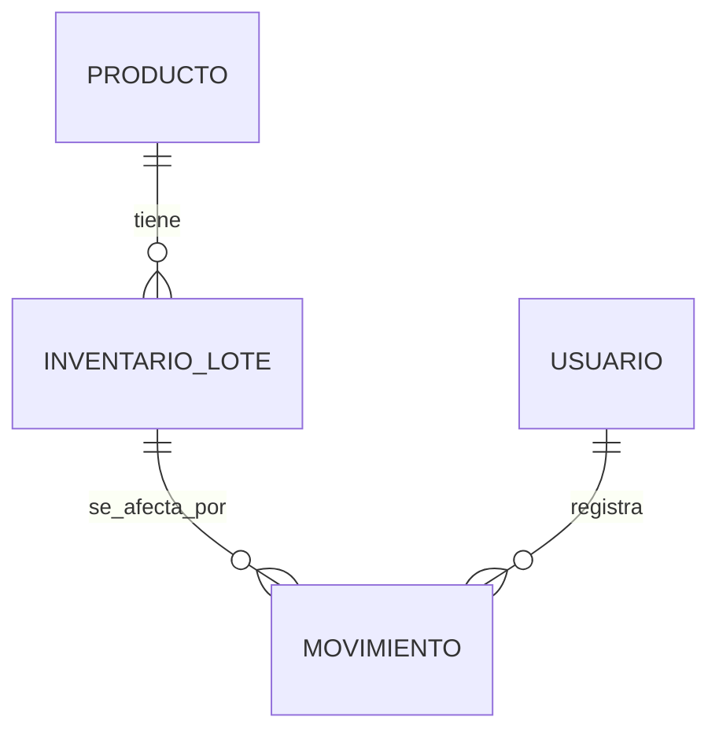
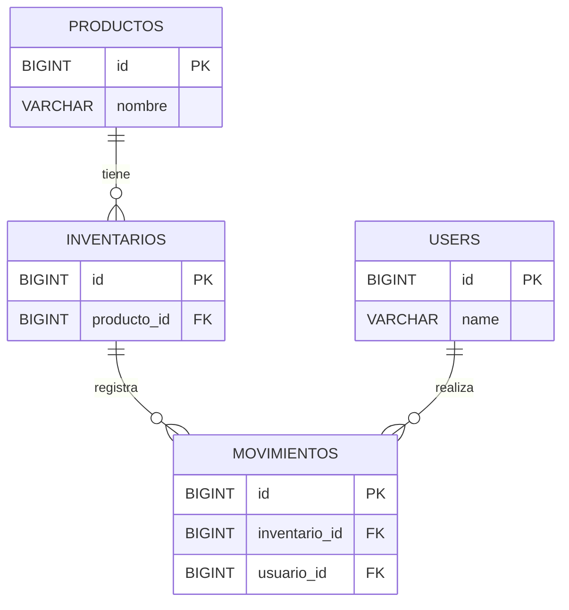
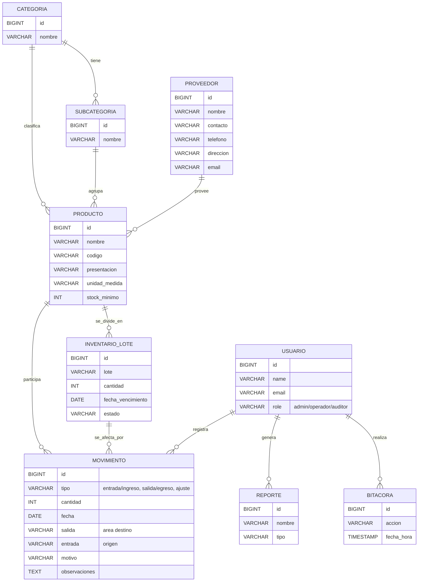

# Comparativa visual y ejemplos

## Ejemplo visual de Diagrama Entidad–Relación (ER)

**Interpretación:**
- Un PRODUCTO puede tener muchos INVENTARIO_LOTE (lotes).
- Un INVENTARIO_LOTE puede tener muchos MOVIMIENTO (entradas/salidas/ajustes).
- Un USUARIO puede registrar muchos MOVIMIENTO.

## Ejemplo visual de Diagrama Relacional

**Interpretación:**
- Aquí se muestran los nombres de tablas y claves foráneas reales.
- Se ve cómo MOVIMIENTOS referencia a INVENTARIOS (inventario_id) y a USERS (usuario_id).

## Tabla comparativa

| Aspecto                | Entidad–Relación (ER)         | Relacional (Tablas/FKs)         |
|------------------------|-------------------------------|----------------------------------|
| Propósito              | Conceptual, entender dominio  | Técnico, implementar en BD       |
| Elementos              | Entidades, relaciones         | Tablas, columnas, FKs, índices   |
| Cardinalidad           | Sí (1:N, N:M, etc.)           | Sí, pero con FKs y restricciones |
| Tipos de datos         | No                            | Sí (VARCHAR, INT, etc.)          |
| Claves primarias/foráneas| No explícito                 | Sí, detallado                   |
| Público objetivo       | Analistas, usuarios, devs     | Devs, DBAs                       |
| Ejemplo                | Producto tiene Lotes          | productos.id, inventarios.producto_id FK |

---

**Conclusión:**
El ER ayuda a entender el negocio y las relaciones, el relacional a implementar y optimizar la base de datos.
# Diagrama Entidad–Relación (Conceptual)

Fecha: 23/10/2025

Este diagrama conceptual refleja las entidades del dominio, sus atributos principales y las relaciones con cardinalidades. Está alineado con las migraciones actuales (productos, inventarios, movimientos, categorías, subcategorías, proveedores, users, bitácora, reportes) y con la trazabilidad por lote.

Cardinalidades y notas:
- "||" = 1 (uno); "o{" = 0..N (cero a muchos).
- Un Producto puede tener 0..N Lotes en Inventario (INVENTARIO_LOTE).
- Un Movimiento afecta exactamente 1 Producto y, en la práctica, se recomienda referenciar 1 Lote (trazabilidad por `inventario_id`).
- Un Usuario registra 0..N Movimientos, genera 0..N Reportes y tiene 0..N registros en Bitácora.
- Un Proveedor suministra 0..N Productos (la FK puede estar deshabilitada en la BD, pero la relación existe conceptualmente).

Diferencias con el diagrama relacional:
- Este ER es conceptual (dominio). El diagrama relacional en `docs/diagrama_relacional.md` muestra tablas, tipos exactos y claves foráneas.
- Aquí se prioriza la comprensión de entidades y relaciones; en el relacional se detallan columnas y restricciones.

Sugerencias:
- Mantener `MOVIMIENTO` → `INVENTARIO_LOTE` obligatorio en la implementación para maximizar la trazabilidad por lote.
- Si se incorpora vencimiento por lote (FEFO), usar `fecha_vencimiento` de `INVENTARIO_LOTE` para priorización de salidas.
