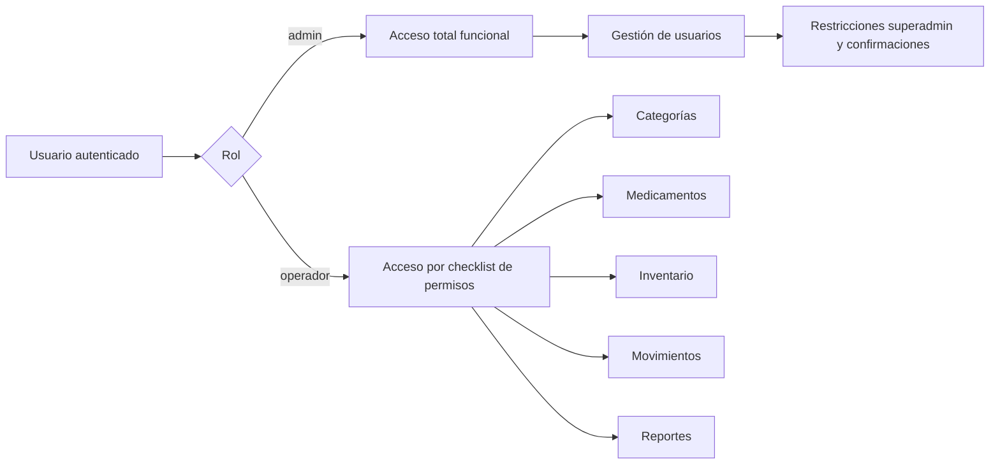
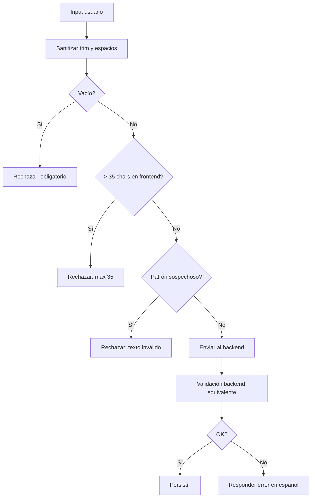

# Resumen de cambios implementados (08-03-2026)

Este documento consolida los cambios funcionales, de seguridad, UX y control de acceso aplicados en el sistema de inventario médico.

---

## 1) Endurecimiento de autenticación y registro

### 1.1 Registro (`AuthController` + `auth.blade.php`)

Se aplicaron validaciones y sanitización para:

- `username`
  - Solo texto real (letras/espacios), límites de longitud.
  - Sanitización de espacios.
  - Detección de entradas sospechosas (repeticiones, cadenas basura).
- `email`
  - Normalización (`trim + lowercase`).
  - Validación de formato y unicidad.
  - Bloqueo de patrones sospechosos (dominios typo comunes, local-part basura).
- Preguntas de seguridad (`color`, `animal`, `padre`)
  - Solo texto real, límites de longitud, sanitización.
  - Filtro anti-basura.
- `password`
  - Política reforzada: mínimo/máximo, mayúscula, minúscula, número y símbolo, sin espacios.
  - Bloqueo de patrones inseguros (repeticiones/triviales).

También se alineó validación frontend/backend para feedback inmediato y prevención temprana.

### 1.2 Inicio de sesión (`AuthController`)

- Conserva bloqueo por intentos fallidos.
- Mantiene notificación de cambio de rol al iniciar sesión cuando aplica.

### 1.3 Recuperación de contraseña (`RecoverController` + `recover.blade.php`)

Se replicó la política de validación/sanitización del registro en el flujo de recuperación:

- Email y respuestas de seguridad con filtro anti-basura.
- Contraseña con reglas reforzadas.
- Reemplazo de alertas nativas por toasts estilizados en español.

---

## 2) Mensajería y UX en español

- Estandarización de alertas y mensajes en español en validaciones y respuestas.
- Ajustes visuales para reducir saturación de texto (uso de `title`/hover en campos cuando corresponde).
- Mejora de toasts: contraste, tamaño, posición y comportamiento estático cuando fue requerido.

---

## 3) Gobierno de roles (admin/superadmin)

### 3.1 Límite de administradores

- Se configuró límite máximo de admins por `config/inventario.php` (`max_admins`).
- Aplicado en backend y reflejado en UI (opción admin oculta/deshabilitada cuando se alcanza el máximo).

### 3.2 Protección de superadmin

- El superadmin (primer usuario del sistema) queda protegido en operaciones críticas.
- Restricciones aplicadas:
  - No eliminación del superadmin.
  - Modificación de superadmin restringida según reglas implementadas.

### 3.3 Endurecimiento de operaciones sensibles

- Confirmación de contraseña del admin para acciones sensibles (crear/promover/modificar/eliminar/desbloquear según caso).
- Registro en bitácora de denegaciones y acciones exitosas.

---

## 4) Permisos granulares por operador

### 4.1 Infraestructura creada

- `config/permissions.php`: catálogo agrupado de permisos.
- `permissions` + `permission_user`: tablas para catálogo y asignación.
- `Permission` model + relación many-to-many en `User`.
- Helpers en `User`:
  - `hasPermission()`
  - `hasAnyPermission()`
- Middleware `permission` registrado en `bootstrap/app.php` y `Kernel.php`.

### 4.2 Gestión desde usuarios

- Endpoints para consultar y actualizar permisos por usuario operador.
- Validaciones de payload y confirmación de contraseña admin para guardar cambios.
- Sincronización de permisos y trazabilidad en bitácora.

### 4.3 UI de checklist

- Botón por operador para abrir modal de permisos.
- Modal con checklist por grupos, acciones marcar/desmarcar todo, y guardado AJAX.
- Reajuste visual del modal para mantener footer/botones visibles.
- Mejora visual del checklist (tarjetas por grupo, estados hover/checked).

---

## 5) Aplicación de permisos en módulos

Se añadieron controles por permiso en controladores/módulos clave:

- Categorías
- Medicamentos/Productos
- Inventario (consulta)
- Movimientos (por tipo de operación)
- Reportes (inventario/salida/exportaciones)

Además, el dashboard/menú se ajustó para mostrar opciones según permisos del operador.

---

## 6) Correcciones técnicas relevantes

### 6.1 Método `middleware()` indefinido en controladores

Se corrigió `app/Http/Controllers/Controller.php` para extender el controlador base de Laravel y habilitar correctamente `$this->middleware(...)`.

### 6.2 Error `DELETE method is not supported for route dashboard`

Se ajustó `PermissionMiddleware` para responder `401/403` en JSON para solicitudes no-GET/AJAX, evitando redirecciones que preserven método HTTP en operaciones como DELETE.

### 6.3 Tipado estático (`hasPermission`/`hasAnyPermission`)

Se tipó explícitamente usuario autenticado en controladores donde el analizador marcaba métodos indefinidos.

---

## 7) Endurecimiento de categorías/subcategorías

### 7.1 Backend (`CategoriaController`, `SubcategoriaController`)

- Sanitización de nombres.
- Reglas de formato y longitud.
- Detección anti-basura para bloquear entradas como:
  - `111111111`
  - `aaaaaaaaaaaaaaa`
  - cadenas sospechosas sin estructura real.
- Mensajes de validación en español.

### 7.2 Frontend (`categoria.blade.php`)

Validación preventiva antes de enviar:

- Sanitización en cliente.
- Validación de longitud y formato.
- Bloqueo de patrones repetitivos/sospechosos.
- **Límite máximo de 35 caracteres** en todos los inputs de categoría/subcategoría en frontend (`maxlength=35` + validación JS).

---

## 8) Diagrama de alto nivel (roles y permisos)

## 9) Diagrama de flujo (validación de nombre de categoría/subcategoría)

---

## 10) Observaciones operativas

- Se mantuvo enfoque de “defensa en profundidad”:
  - Validación temprana en frontend.
  - Validación/autorización definitiva en backend.
  - Registro de eventos críticos en bitácora.
- Las pruebas automáticas se ejecutaron repetidamente tras cambios y se mantuvieron en verde.

---

## 11) Pendientes recomendados (no bloqueantes)

- Agregar pruebas específicas para casos anti-basura en categorías/subcategorías.
- Evaluar formalizar `superadmin` como atributo explícito (además de la regla por primer usuario), si el negocio lo requiere.
- Homologar respuesta 401/403 JSON en otros middleware personalizados para consistencia total.

---

## 12) Actualización 16/03/2026 — Recuperación por token de correo

Se actualizó el flujo de recuperación de contraseña para operar en dos factores del mismo canal (conocimiento + posesión de correo):

1. **Verificación progresiva de seguridad**
  - Preguntas base: `color` y `animal`.
  - Si una falla, se exige tercera pregunta: `padre`.
  - Comparación robusta con normalización de texto y compatibilidad retroactiva.

2. **Desafío de token por correo**
  - Código de 6 dígitos generado por backend.
  - Almacenamiento **hasheado** en caché (no en texto plano).
  - Vigencia del código: **2 minutos**.
  - Máximo de intentos por emisión: **3**.
  - Reenvío con cooldown: **45 segundos**.

3. **Controles adicionales**
  - Respuesta uniforme en el paso de correo para reducir enumeración de cuentas.
  - Throttle activo en endpoints de recuperación.
  - reCAPTCHA opcional según configuración (`RECAPTCHA_ENABLED`).
  - Cuenta regresiva visible en frontend, con validación definitiva en backend.

4. **Artefactos impactados**
  - `app/Http/Controllers/RecoverController.php`
  - `resources/views/recover.blade.php`
  - `resources/views/emails/recover-token.blade.php`
  - Documentación en `docs/casos_de_uso.txt`, `docs/diagrama_flujo.txt`, `docs/diagrama_entidad_relacion.txt`, `docs/diagrama_relacional.txt`.
